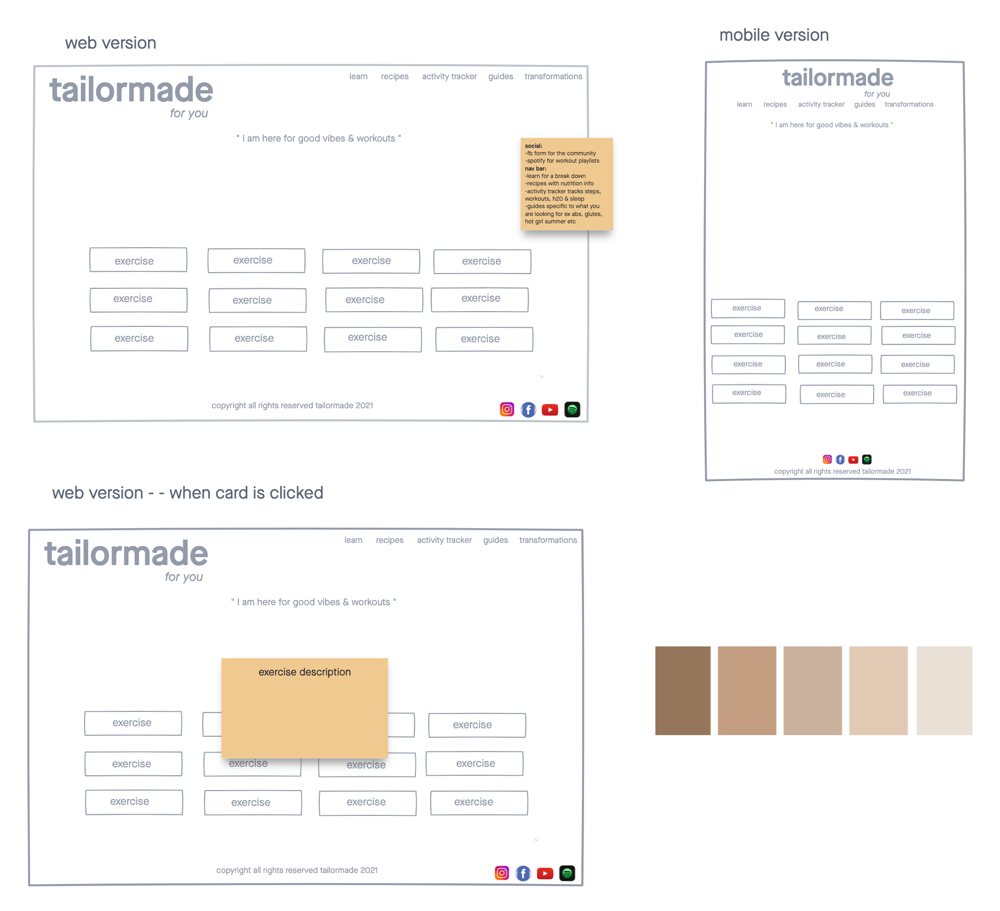

# tailormade *for you* 

a simple minimalistic web application that provides custom daily workouts

## technologies used

* HTML5
* CSS3
* JavaScript
* j Query
* [tailormade API]("https://wger.de/api/v2/exercise/")
* [Instagram](https://www.instagram.com/)
* [icons](https://fontawesome.com/icons?d=gallery&p=2)
* [fonts](https://fonts.google.com/)

## user stories
* as a user I want be able to have exercises at my finger tips for the gym and home
* as a user I want no pressure and do be able personalize a routine for myself
* as a user I want exercises to be easily accessible to me without having to do endless searching

## screenshots
### wireframes

### working app
 
 

## getting started

click here to see the deployed app!

## future enhancements
* the ability for the user to click to the next 12 exercises
* the ability for the user to click on all the buttons in the navigation bar as well as the social links
* allow users to utilize the recipes, activity trackers, pick from different focused guides, and look through successful transformations

