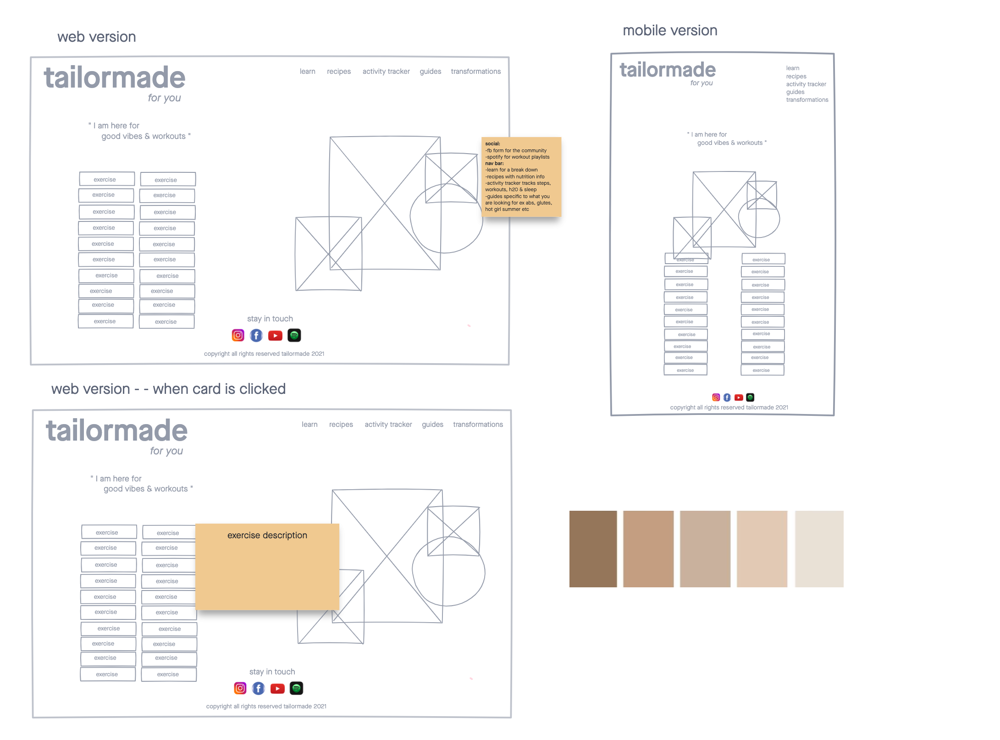
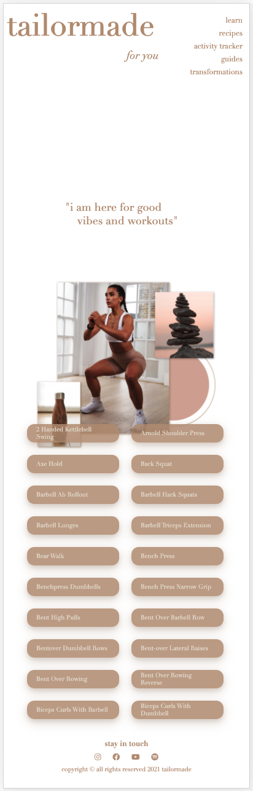
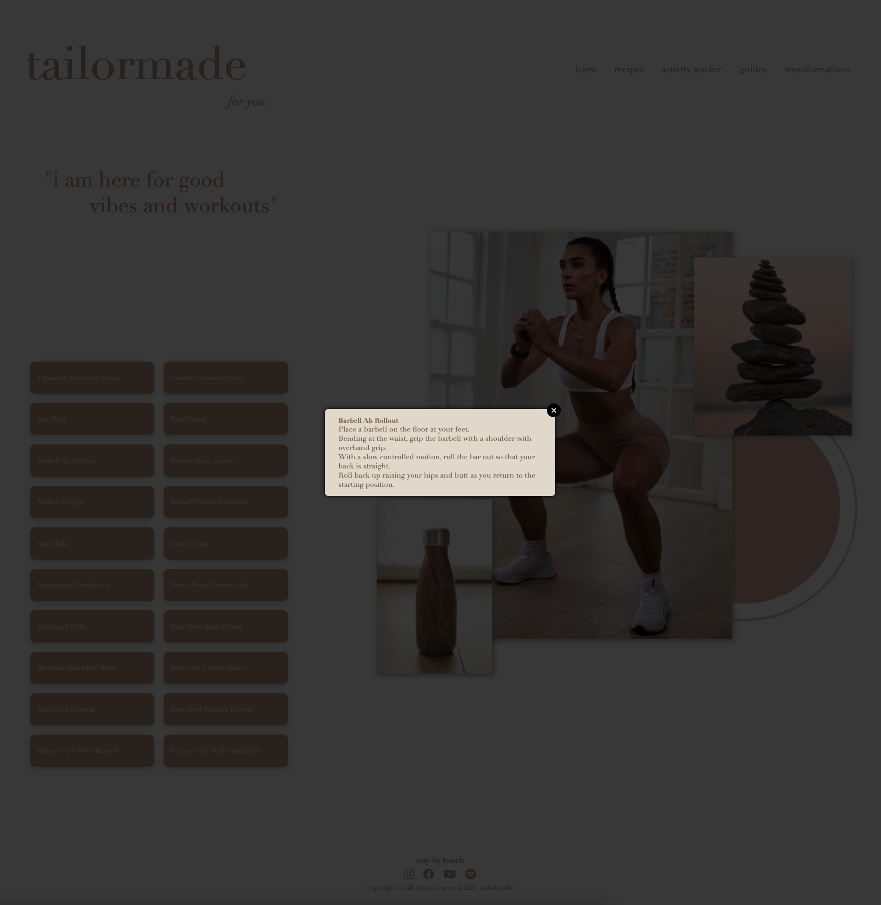
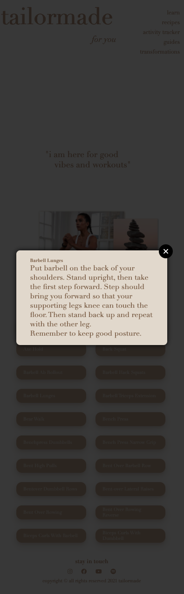

# tailormade *for you* 

a simple minimalistic web application that provides custom daily exercises

## technologies used

* HTML5
* CSS3
* JavaScript
* jQuery
* [tailormade API]("https://wger.de/api/v2/exercise/")
* [facebook](https://www.facebook.com/weglowapp/photos/130141715577102)
* [icons](https://fontawesome.com/icons?d=gallery&p=2)
* [figma](https://www.figma.com/files/user/979381893432674988?fuid=979381893432674988)
* [pinterest](hhttps://www.pinterest.com/)
* [unsplash](https://unsplash.com/)
* [imgur](https://imgur.com/)
* [invisionapp](https://www.invisionapp.com/inside-design/design-resources/do/)

## user stories
* as a user I want be able to have exercises at my finger tips for the gym and home
* as a user I want to be able to personalize a routine for myself without any pressure
* as a user I want exercises to be easily accessible to me without having to do endless searching

## screenshots
### wireframe

### working app

## getting started

click here to see the deployed app!

## future enhancements
* the ability for the user to click/swipe to the next 20 exercises
* the ability for the user to click on all the buttons in the navigation bar/social links to utilize all the different recipes, activity trackers, focused guides, and to be able to look through successful transformations
* full blown fitness app

